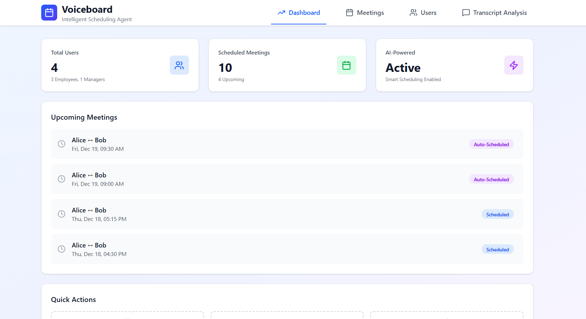
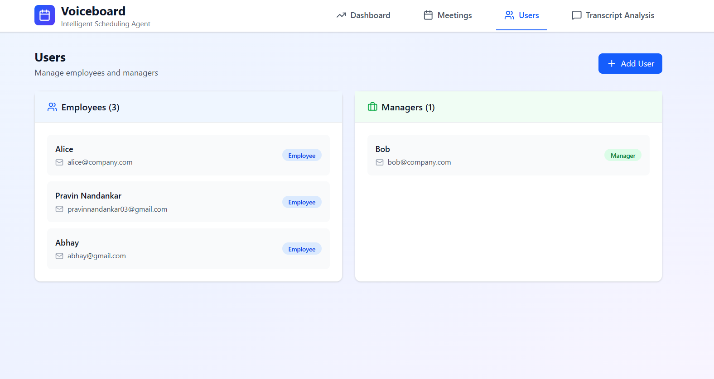
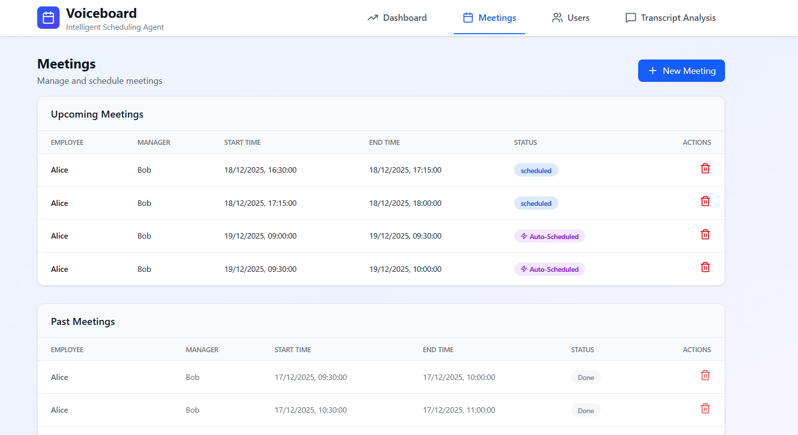
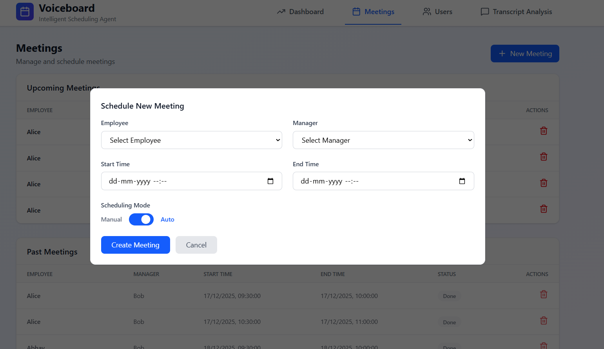
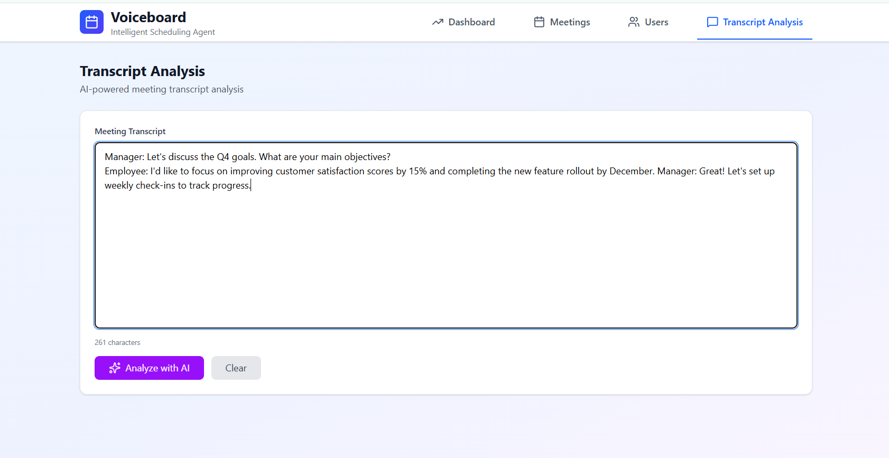
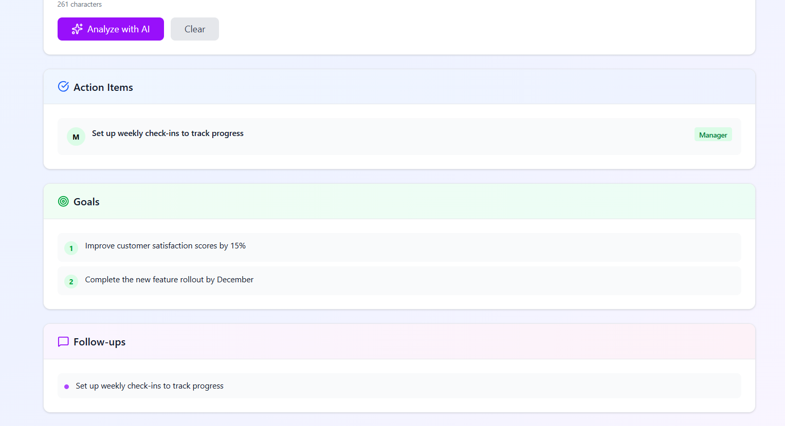

# 🧠 Smart Meeting & Transcript Management Platform

A **full-stack enterprise platform** to manage **employees and managers**, schedule meetings **intelligently**, resolve conflicts **automatically**, and analyze **meeting transcripts** for actionable insights.

Built using **Node.js, Express, MongoDB, and React**, with a strong focus on **real-world scheduling logic** instead of naive time grids.

---

## 🚀 Features

### 👤 User Management
- Create and manage **Employees** and **Managers**
- Role-based handling across the platform
- Meetings consider availability of **both participants**

---

### 📅 Smart Meeting Scheduling
- Manual meeting scheduling
- Intelligent conflict detection
- **Gap-based scheduling logic** (Google/Outlook-style)
- Supports **variable meeting durations** (30 min, 60 min, etc.)
- Enforces configurable **working hours**
- Separate views for **upcoming** and **past** meetings

---

### ⚡ Auto-Rescheduling
- Automatically schedules meetings when conflicts occur
- Prefers **same-day scheduling** when continuous time is available
- Falls back to **next working day** when needed
- Auto-scheduled meetings are clearly marked

---

### 💡 Manual Mode with Suggestions
- On conflict, backend returns **suggested available time slots**
- Frontend displays suggestions inline
- **One-click scheduling** from suggested slots

---

### 🧾 Transcript Analysis
- Submit or upload meeting transcripts
- Automatically extracts:
  - Action items
  - Decisions
  - Follow-ups
- Useful for **1-on-1s, reviews, and team meetings**

---

## 🧠 Scheduling Logic (Core Concept)

This system uses **gap-based scheduling**, not fixed grids.

### How it works:
1. Scheduling starts from the **requested start time**
2. If a conflict exists:
   - Jump to the **end of the conflicting meeting**
3. Check if the **entire duration fits continuously**
4. If yes → schedule immediately
5. If no → move to **next working day (9:00 AM)**
### Example
Existing meetings:
12:00 – 14:00
16:00 – 17:00

Requested:
13:00 – 13:30

Scheduled:
14:00 – 14:30 ✅

This mimics real calendar behavior.

---

## 🛠 Tech Stack

### Backend
- Node.js
- Express.js
- MongoDB
- Mongoose

### Frontend
- React
- React Router DOM
- Tailwind CSS
- Lucide Icons
- React Hot Toast


## Run 
#### Backend :

```bash
cd server
npm install
node server.js
```

#### Frontend :

```bash
cd client
npm install
npm run dev
```

### Screenshots 

```markdown






```